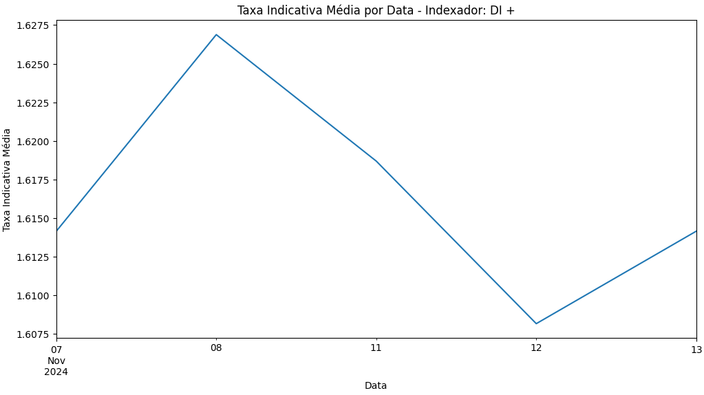
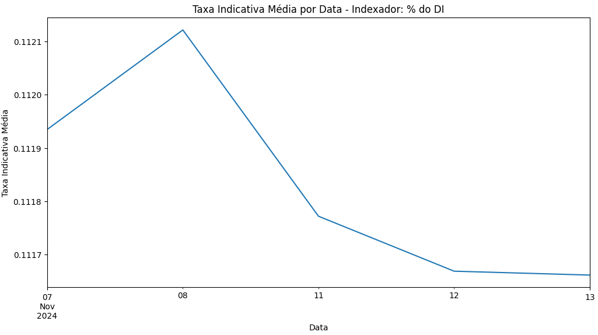
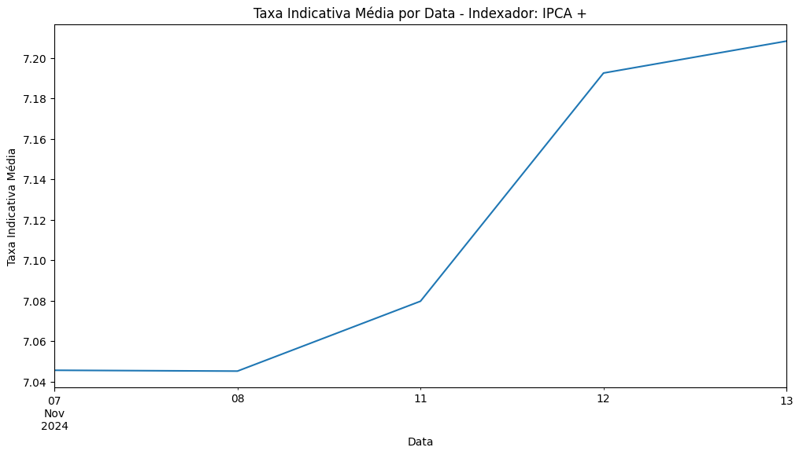
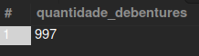
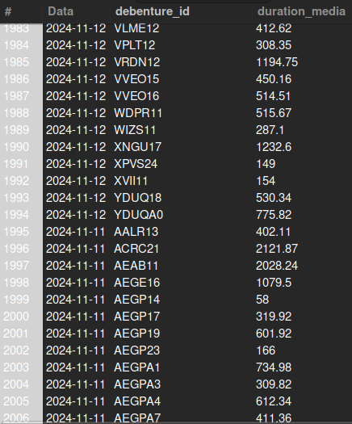
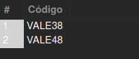

# Consolidação de Dados de Negociação de Debêntures

No desafio proposto, eu automatizo o processo de download, consolidação e análise de dados de negociação de debêntures corporativas do mercado secundário brasileiro, fornecendo insights para a equipe de Research. Além disso, inclui as consultas SQL para análise de dados em um banco de dados relacional.

---

## Estrutura do Projeto

1. **Automação e Consolidação de Dados (`coleta.ipynb`)**:
   - Cria uma pasta chamada `Daily Prices`, caso ela não exista.
   - Realiza o download dos dados dos últimos 5 dias úteis diretamente do site da ANBIMA automaticamente.
   - Converte os arquivos `.xls` baixados para o formato `.csv` e salva cada página das planilhas como arquivos separados.
   - Consolida os dados em um único dataset (`bcp_final.csv`), selecionando colunas relevantes e adicionando uma coluna para identificar o indexador da debênture (`DI +`, `IPCA +`, `% do DI` ou `Outro`).

2. **Análise Gráfica (`coleta.ipynb`)**:
   - Calcula a taxa indicativa média por data para cada indexador.
   - Plota gráficos separados para cada indexador, visualizando as tendências ao longo dos dias.

3. **Banco de Dados (`schema.sql` e `consultas.sql`)**:
   - **Criação do Esquema**:
     - Define um banco de dados `debentures_db` e uma tabela `debentures` para armazenar os dados.
   - **Consultas SQL**:
     - **Quantidade de debêntures listadas no dia anterior.**
     - **Duration média das debêntures nos últimos 5 dias úteis.**
     - **Códigos únicos de todas as debêntures emitidas pela empresa “VALE S/A”.**

---

## Pré-requisitos

- Python 3.8 ou superior.
- Pacotes Python:
  - `pandas`
  - `numpy`
  - `matplotlib`
  - `requests`
  - `openpyxl` (para leitura de arquivos Excel).
- Servidor MySQL para executar as consultas SQL.

---

## Execução do Projeto

1. **Configuração Inicial**:
   - Certifique-se de que todas as dependências estejam instaladas.

2. **Coleta de Dados**:
   - Execute o notebook `coleta.ipynb` para fazer o download, converter e consolidar os dados.

3. **Gráficos**:
   - Visualize os gráficos gerados no notebook para entender as tendências de taxa indicativa.

4. **Banco de Dados**:
   - Execute o script `schema.sql` para criar o banco de dados e a tabela.
   - Carregue os dados do arquivo `bcp_final.csv` para o banco de dados.
   - Use `consultas.sql` para executar as análises descritas.

---

## Arquivos

- **`coleta.ipynb`**: Código Python para automação, consolidação e análise de dados.
- **`schema.sql`**: Script SQL para criação do banco de dados e tabela.
- **`consultas.sql`**: Consultas SQL para análise de dados no banco de dados.
- **`Daily Prices/`**: Pasta contendo os arquivos `.csv` de dados diários e o dataset consolidado `bcp_final.csv`.

---

## Gráficos e Retorno das Consultas SQL

   ### Gráficos Gerados:
   - **DI +**  
     

   - **% do DI**  
     

   - **IPCA +**  
     

   ### Consultas SQL:
     - **Consulta 1**
       

     - **Consulta 2**
       

     - **Consulta 3** 
       

---

## Autor

- **Felipe Mendes Salles**